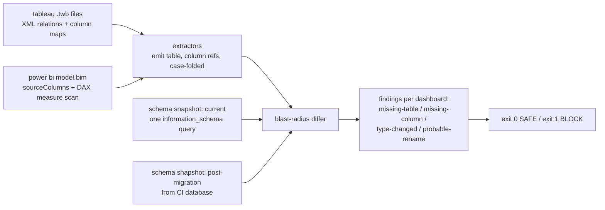

# dashboard-drift-radar

**CI gate that blocks warehouse schema migrations which would break BI dashboards: parses Tableau workbooks and Power BI models for column references, diffs them against schema snapshots, and names exactly which dashboard breaks and why. A 1,000-dashboard fleet gates in 0.16 seconds.**


## What this solves

- Schema migrations ship green because nothing in the *warehouse* tests the *dashboards*; the first alert is an executive looking at a blank tile. This gate fails the migration PR instead, naming the dashboard, the table, and the column.
- "Column exists" is not "dashboard works": a `decimal` column retyped to `varchar` still exists while every SUM over it dies. Migration mode diffs two schema snapshots and flags breaking type-family changes.
- Most breakage is a rename, and the fix is trivial when you know it; the gate attaches probable-rename hints (`segment` likely became `customer_segment`, update the Tableau source) so the finding ships with its remedy.

## Why this exists

BI dashboards are the most visible consumers of a warehouse and the least tested. dbt tests guard models; nothing standard guards the .twb workbooks and Power BI datasets pointed at those models. The dependency information exists on both sides: workbooks and models declare exactly which physical tables and columns they touch, and `information_schema` declares what the warehouse offers. This tool joins the two.

Extractors reduce each artifact to a set of (table, column) references: Tableau .twb XML via relation and column-map parsing (resolving datasource aliases to physical tables), Power BI model.bim JSON via table sourceColumns plus DAX measure-expression scanning, so a measure over a dropped column flags even when the visible column list survived. All references are case-folded, because warehouses and BI tools disagree about identifier case. The differ then checks every dashboard against the target schema, with two modes: single-snapshot (drift detection against production now) and two-snapshot migration mode, which adds type-family change detection and rename hints (ADR-0002).

Exit codes make it a gate: 0 safe, 1 block migration, 3 could-not-run. Wire it next to the migration in CI and the blast radius becomes a review comment instead of an incident.

## Architecture



## Tech stack

| Technology | Role in this project | Why chosen here |
|---|---|---|
| Python 3.10+ (stdlib XML/JSON) | Extractors, differ, CLI | Artifact parsing is stdlib territory; zero heavy dependencies |
| DuckDB | Optional live schema source | Reads information_schema from a .duckdb file; JSON snapshots cover every other warehouse |
| Typer | CLI (`simulate`, `gate`) | Exit codes wire into CI |
| difflib + containment scoring | Rename hints | Measured: plain similarity misses prefix renames (see war story) |
| pytest + pytest-cov | 15 tests, 96% measured coverage | Extractor fixtures share the simulator's artifact shapes |
| ruff + GitHub Actions | Lint and CI, coverage gate at 90% | Matrix on 3.10 and 3.12 |

## Quickstart

Prerequisites: Python 3.10+, pip.

```bash
git clone https://github.com/kattakeerthnareddy/dashboard-drift-radar.git
cd dashboard-drift-radar
pip install -e ".[dev]"

# demo assets: 4 dashboards + current and post-migration schema snapshots
ddr simulate

# against the current schema: SAFE, exit 0
ddr gate --dashboards data/generated/dashboards \
         --schema data/generated/schema_current.json

# against the migrated schema: BLOCK MIGRATION, exit 1, findings with hints
ddr gate --dashboards data/generated/dashboards \
         --schema data/generated/schema_migrated.json \
         --before data/generated/schema_current.json

# run the tests
pytest -q
```

For a real warehouse, a snapshot is one query, exported as JSON rows of `{table, column, type}`:

```sql
SELECT table_name AS "table", column_name AS "column", data_type AS "type"
FROM information_schema.columns WHERE table_schema = 'ANALYTICS';
```

## Performance under load

Methodology: `python benchmark/run_benchmark.py` generates dashboard fleets (90% .twb, 10% .bim) and times parse plus diff against the demo migration. Hardware: 2 vCPU, 8 GB RAM container. Raw output: `benchmark/results/benchmark_results.json`.

| Fleet size | Parse | Diff | Total gate time |
|---|---|---|---|
| 50 dashboards | 8 ms | 1 ms | 9 ms |
| 200 dashboards | 29 ms | 3 ms | 32 ms |
| 1,000 dashboards | 150 ms | 12 ms | 162 ms |

The gate is effectively free at any realistic fleet size; parse cost dominates and scales linearly with file count. The honest limit is fidelity, not speed: custom SQL blocks inside workbooks are not parsed for references (see Failure modes), and the benchmark's workbooks are simulator-shaped, real .twb files carry more XML per reference so parse time grows with file size, not reference count.

## Architecture decisions

- [ADR-0001](docs/adr/0001-static-artifact-parsing.md): parse the artifacts in the PR, not the BI server's APIs. Credential-free, gates before deploy; the fidelity gap is named.
- [ADR-0002](docs/adr/0002-two-snapshot-migration-mode.md): two-snapshot migration mode for type-change detection and rename hints; single-snapshot mode for drift.

## Intentionally out of scope

- **Custom SQL parsing inside workbooks.** A workbook with a freeform SQL block needs a SQL parser pass (sqlglot) over that block; deferred until a real workbook corpus shows how common it is. Until then such workbooks yield fewer references and a logged warning, never a silent pass of an unchecked block.
- **BI-server API enrichment** (view counts, owners, notification routing). Additive layer once the gate itself has earned its CI slot.
- **Looker/dbt exposures.** LookML is the easiest of the three formats; the ColumnRef currency makes it a new extractor, not a redesign.

## Security and compliance

- No credentials anywhere: inputs are files from the repo and a schema snapshot from CI.
- Artifacts can embed connection metadata; the extractors read only structural elements (relations, maps, columns, measure expressions) and reports contain only table/column names, never connection strings or data.
- Runs entirely offline; nothing leaves CI.

## Failure modes

| Failure | Detection | Behavior | Recovery |
|---|---|---|---|
| Workbook is invalid XML / model is invalid JSON | Parse error per file | Exit 3 naming the file | Fix or exclude the artifact |
| Workbook yields zero references | Post-parse check | Logged warning (likely custom SQL or an extract-only workbook) | Treat as uncovered, not as safe; see out-of-scope |
| Empty dashboards directory | Collection check | Exit 3: a gate over nothing must not report SAFE | Point at the right directory |
| Schema snapshot malformed/empty | Loader validation | Exit 3, names the problem | Re-export the snapshot |
| Case mismatch between BI tool and warehouse | Case folding at every boundary | No false findings from case alone | None needed |
| Rename hint is wrong | Human review of the hint | Hints never auto-fix; missing-column finding stands on its own | Update the artifact to whatever the rename truly was |

## Hardest problem solved

The rename-hint test failed on the most ordinary case imaginable: `region` renamed to `customer_region` produced no hint. The heuristic used `SequenceMatcher.ratio()` with a 0.6 threshold, and that pair scores 0.571, because edit-based similarity pays for every inserted character and a prefix addition inserts many. Meanwhile the demo's `segment` to `customer_segment` scored 0.609 and passed, which is what made the gap invisible until a test tried a shorter stem: the heuristic was knife-edge on exactly the rename pattern warehouses use most (adding a qualifying prefix).

The fix scores containment directly: if the missing column's name is contained in an added column's name (or vice versa) with at least a 4-character shared stem, that candidate scores 0.9, with edit similarity as the fallback for true respellings. The failing test was committed before the fix, and the commit message carries the measured ratios. The general lesson: when a heuristic's threshold sits within noise distance of its most common real-world input, the threshold is not conservative, it is broken, and only a test with a short example exposed it.

## Future work

- sqlglot pass over custom SQL blocks in workbooks, closing the main fidelity gap.
- LookML and dbt-exposure extractors onto the same ColumnRef currency.
- Owner routing: map dashboards to owners and open review requests on the artifacts a migration breaks.
- GitHub Action wrapper publishing findings as PR annotations.
- First metric to watch in real use: zero-reference workbook rate; if it climbs, custom SQL parsing stops being future work.
